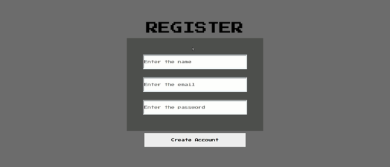
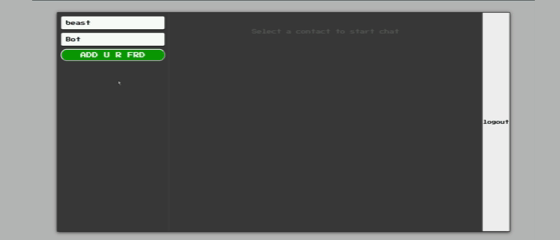

<div align="center">

# 💬 Chat-Easyy

### Real-time messaging, minus the complexity


[](https://react.dev/)
[](https://nodejs.org/)
[](https://expressjs.com/)
[](https://socket.io/)
[](https://www.mongodb.com/)
[](https://jwt.io/)


**[🔗 Live Demo](https://chateasyy.netlify.app/)**

</div>

<br />

<div align="center">
  
  <p><i>Register in seconds — name, email, password, done.</i></p>
</div>

<br />

## What is Chat-Easyy?

Chat-Easyy is a full-stack real-time messaging app built on the **MERN stack**
and **Socket.IO**. Create an account, add a friend by their email, and start
talking — messages show up instantly on both ends, no refresh required, and
the full conversation history is waiting for you the next time you log back in.

It's built the way real chat apps are: REST APIs handle the durable stuff
(accounts, friends, message history), while a WebSocket layer handles the
part that has to feel instant — delivering messages the moment they're sent.

## Features

### 🔐 Authentication
- Register and log in with a hashed password (bcrypt) and a JWT-backed session
- Session persists in local storage, with a clean logout flow

### 👥 Friends, by email
- Search for anyone by their email and add them as a friend
- Friend list doubles as your contact list — tap a name, start chatting

<div align="center">
  
</div>

### 💬 Real-time messaging
- Powered by Socket.IO — messages arrive live, with no polling and no page reload
- **Optimistic UI**: your own messages appear the instant you hit send, before the server even responds
- Auto-scroll keeps the latest message in view as new ones come in

### 💾 Messages that stick around
- Every message is saved to MongoDB
- Pick a friend and Chat-Easyy automatically loads your full history with them — refresh the page and it's all still there

## Tech stack

| Layer | Tools |
|---|---|
| **Frontend** | React.js, React Router DOM, Axios, Socket.IO Client, CSS3 |
| **Backend** | Node.js, Express.js, Socket.IO, JWT, bcrypt |
| **Database** | MongoDB, Mongoose |
| **Tooling** | Vite, Git, GitHub, Postman |

## How it works

```
                         REST (login, register, friends, message history)
User ──▶ React Frontend ──▶ Express API ──▶ MongoDB
   │
   └────────────▶ Socket.IO ──▶ Socket Server ──▶ Socket.IO ──▶ Friend
                         (live message delivery, instantly)
```

Authentication and data persistence go through REST; the moment a message
needs to *arrive*, that's Socket.IO's job. Login registers the user's socket
connection, messages get saved to Mongo **and** emitted live in the same
step, and the connection closes cleanly on logout.

## Project structure

```
Chat-Easyy/
├── frontend/
│   ├── components/
│   ├── pages/
│   ├── css/
│   └── App.jsx
├── backend/
│   ├── controllers/
│   ├── routes/
│   ├── models/
│   ├── middleware/
│   ├── socket.js
│   └── server.js
└── README.md
```

## Getting started

> Adjust paths, ports, and variable names to match your actual project layout.

### Prerequisites
- Node.js 18+
- A MongoDB connection string (local or [MongoDB Atlas](https://www.mongodb.com/atlas))

### Installation

```bash
git clone https://github.com/<your-username>/chat-easyy.git
cd chat-easyy

cd backend && npm install
cd ../frontend && npm install
```

### Configuration

Create a `.env` file inside `backend/`:

```env
MONGO_URI=your_mongodb_connection_string
JWT_SECRET=your_jwt_secret
PORT=5000
```

### Run it

```bash
# terminal 1 — backend
cd backend
npm start

# terminal 2 — frontend
cd frontend
npm run dev
```

Open the frontend URL, register an account, add a friend by email, and start chatting.

## Roadmap

- [ ] Online / offline status
- [ ] Typing indicator
- [ ] Read receipts (✓✓) and timestamps
- [ ] Image / file sharing
- [ ] Emoji picker
- [ ] Group chats
- [ ] Voice & video calling
- [ ] Dark / light themes
- [ ] Profile pictures & last seen
- [ ] AI reply suggestions

## What I learned

Building Chat-Easyy meant working through a full-stack app end to end:
designing REST APIs, wiring up JWT authentication, modeling relationships
in MongoDB with Mongoose, and layering Socket.IO on top for real-time
delivery — plus the frontend side of keeping React state in sync with a
live, asynchronous connection.

## License

Distributed under the MIT License. See `LICENSE` for details.

<div align="center">
  <sub>Built with the MERN stack + Socket.IO · 2026</sub>
</div>
